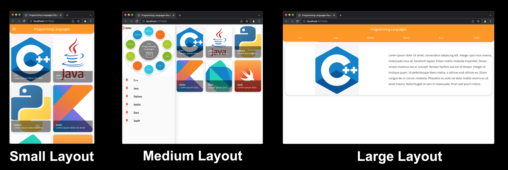

# How to make your Flutter App Responsive
___





Building a **Responsive App** that supports **Various Screen Sizes** is one of the most challenges that every flutter developer-facing.

Because remember without **responsiveness** your app will have a **bad user experience** which will cause you problems in different screen sizes.
___
Every **Screen** we are going to make will have **3 Layouts**

1- Small Layout (for **Mobiles**)

2- Medium Layout (for **Mobiles**, **Tablets**, etc...)

3- Large Layout (for **Tablets**, **Desktops**, etc...)
___
### How are we going to make 3 layouts per one screen? 🤔

Google Material Design made a very good concept called **Responsive Layout Grid** that will help us to make a nice responsive app 😎😎
___
### How Responsive Layout Grid Working? 🧐
By **dividing** our screen into a **GridView**. our app screen will actually be **divided into columns** and every time our app screen **grows** the **number of columns will grows as well**


> More information about Responsive Layout Grid you can visit this link: [click here](https://material.io/design/layout/responsive-layout-grid.html)

___

>We said we are going to make **3 layouts per screen** but **how on the earth** we are going to know when to **switch** from one layout to another? 😐

There is a concept is **Responsive Layout Grid** called **Breakpoint system** which is when the **screen width** become grater than specific breakpoint then **switch** to another layout

We will use these breakpoints which are **recommended** from the responsive layout grid concept

1- **Small Layout** if app screen **width** from **(0 - 599dp)**

2- **Medium Layout** if app screen **width** from **(600dp - 839dp)**

3- **Large Layout** if app screen **width** from **840dp and above**

So we will make an ``if statement`` when the **screen width** is less than 600dp this means we are in a **small layout**.

else if the screen width is greater than or equal 600dp and less than or equal 839dp we will switch to **medium layout**.
else we will switch to **large layout**


``` java
switch(APP_SCREEN_WIDTH){
case APP_SCREEN_WIDTH < 600: return smallLayout();
case (APP_SCREEN_WIDTH >= 600 && APP_SCREEN_WIDTH <= 839): return mediumLayout();
default: return largeLayout();
}

```
___
> Now **How on the earth** are we going to know the app screen width in our flutter app?

Luckily, flutter made a lot of widgets that will help us build a responsive app and these widgets are:

- MediaQuery
- LayoutBuilder
- OrientationBuilder
- Expanded
- Flexible
- FractionallySizedBox
- AspectRatio
- FittedBox
- Wrap


We will use **MediaQuery** to determine the app **screen width** and then **switch to another layout**
>What is MediaQuery ?

It is a **flutter widget** that provides us **two important** things

1- **App Level** Information: e.g. (app screen width & height)

2- **Device Level** Information: e.g. (app screen orientation)

___

Also, we are going to use **LayoutBuilder** Widget to build a **responsive widget** that **match our screen layout**

>How **LayoutBuilder** works?

The LayoutBuilder widget works by providing a **"BoxContraints"** for the widget we are going to build
**Every time the app screen width changes the builder() method of the LayoutBuilder will provide a "BoxConstraints"**

The **BoxContraints** will determine the **maximum width & height** that the widget can take

``` java
return LayoutBuilder(
builder: (BuildContext context,BoxContraints boxcontraints){
if(boxcontraints.maxWidth < 600){
return smallWidget();
}
else if(boxcontraints.maxWidth >= 600 &&boxcontraints.maxWidth <= 839){
return mediumWidget();
}
else return largeWidget();
}
)
```
___
#### So, what do we understand from all of the above? 🙄

>We will use **MediaQuery** to **switch between layouts**

>We will use **LayoutBuilder** to **build widgets** that match each layout content


And that's basically it 😊😊
